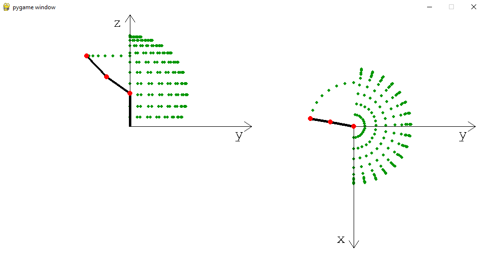
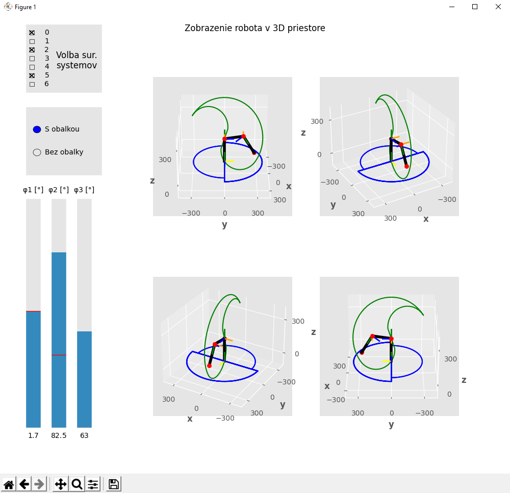
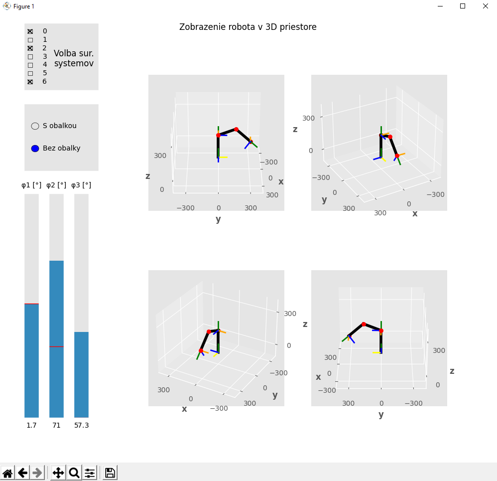

# Robot arm Animation
School assignment. Simulating robot arm in specified movement.

This project contains of 2 programs. 

Both are started at the same time in separate threads. 
First part is pygame 3D simulation, second is MatplotLib application with GUI menu.

- You can run it by:

                                python main.py

3D animation:

GUI app with settings for better visualisation:

 or 

